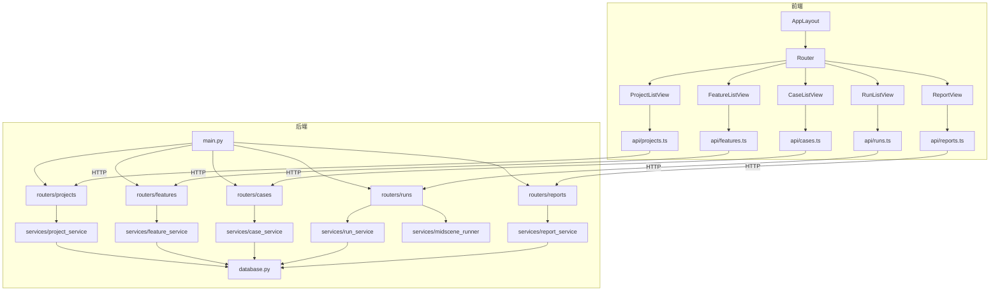

---
创建时间：2026-05-23 16:12
最后更新：2026-05-23 16:12
状态：设计中
---

# L1-TASK-001 项目整体架构设计文档

## 1. 需求摘要

Quality Hub 是一个项目质量管理平台，核心功能：
- **项目管理**：关联 GitHub 仓库，管理项目元数据
- **功能点管理**：从 PRD/Issue 拆解功能点，追踪覆盖状态
- **测试用例管理**：CRUD 测试用例，关联功能点
- **执行管理**：集成 Midscene.js 执行 E2E 测试，管理执行记录
- **报告看板**：覆盖率、通过率、趋势图表

## 2. 方案选择

| 方案 | 优点 | 缺点 | 选择 |
|------|------|------|------|
| 单体 FastAPI + Vue SPA | 部署简单、开发快、适合小团队 | 后期拆分成本 | ✅ 选用 |
| 微服务 | 独立扩展 | 过度设计、运维复杂 | ❌ |
| Monorepo (Nx) | 统一管理 | 学习成本高、项目规模不需要 | ❌ |

**选择理由**：项目初期用户量小，SQLite 足够，单体架构开发效率最高。后端按模块拆分 router，未来可平滑迁移到微服务。

| 决策项 | 选择 | 理由 |
|--------|------|------|
| 数据库 | SQLite + aiosqlite | 零运维、初期够用、后续可换 PostgreSQL |
| ORM | SQLAlchemy 2.0 (async) | 生态成熟、支持异步、迁移方便 |
| 迁移工具 | Alembic | SQLAlchemy 标配 |
| E2E 执行 | subprocess 调用 Midscene CLI | 解耦、进程隔离、失败不影响主进程 |
| 前端路由 | Vue Router 4 | Vue 3 标配 |
| 图表 | ECharts (vue-echarts) | 功能强大、中文友好 |


## 3. 文件结构

```
quality-hub/
├── backend/
│   ├── app/
│   │   ├── __init__.py
│   │   ├── main.py                  # FastAPI 入口，挂载所有 router
│   │   ├── config.py                # 配置管理（环境变量、数据库路径）
│   │   ├── database.py              # SQLAlchemy 引擎 & session
│   │   ├── models/
│   │   │   ├── __init__.py
│   │   │   ├── project.py           # 项目表
│   │   │   ├── feature.py           # 功能点表
│   │   │   ├── test_case.py         # 测试用例表
│   │   │   ├── test_run.py          # 执行记录表
│   │   │   └── test_result.py       # 单条用例执行结果表
│   │   ├── schemas/
│   │   │   ├── __init__.py
│   │   │   ├── project.py           # 项目 Pydantic 模型
│   │   │   ├── feature.py           # 功能点 Pydantic 模型
│   │   │   ├── test_case.py         # 测试用例 Pydantic 模型
│   │   │   ├── test_run.py          # 执行记录 Pydantic 模型
│   │   │   └── report.py            # 报告数据 Pydantic 模型
│   │   ├── routers/
│   │   │   ├── __init__.py
│   │   │   ├── projects.py          # /api/projects
│   │   │   ├── features.py          # /api/features
│   │   │   ├── cases.py             # /api/cases
│   │   │   ├── runs.py              # /api/runs
│   │   │   └── reports.py           # /api/reports
│   │   ├── services/
│   │   │   ├── __init__.py
│   │   │   ├── project_service.py   # 项目业务逻辑
│   │   │   ├── feature_service.py   # 功能点业务逻辑
│   │   │   ├── case_service.py      # 用例业务逻辑
│   │   │   ├── run_service.py       # 执行业务逻辑
│   │   │   ├── midscene_runner.py   # Midscene.js 进程管理
│   │   │   └── report_service.py    # 报告聚合逻辑
│   │   └── utils/
│   │       ├── __init__.py
│   │       └── exceptions.py        # 统一异常定义
│   ├── alembic/                     # 数据库迁移
│   │   ├── env.py
│   │   └── versions/
│   ├── alembic.ini
│   ├── pyproject.toml               # uv 项目配置
│   └── tests/
│       ├── conftest.py
│       ├── test_projects.py
│       ├── test_features.py
│       ├── test_cases.py
│       ├── test_runs.py
│       └── test_reports.py
├── frontend/
│   ├── src/
│   │   ├── main.ts                  # Vue 入口
│   │   ├── App.vue                  # 根组件
│   │   ├── router/
│   │   │   └── index.ts             # 路由配置
│   │   ├── stores/
│   │   │   ├── project.ts           # 项目 store
│   │   │   ├── feature.ts           # 功能点 store
│   │   │   ├── case.ts              # 用例 store
│   │   │   ├── run.ts               # 执行 store
│   │   │   └── report.ts            # 报告 store
│   │   ├── views/
│   │   │   ├── ProjectListView.vue  # 项目列表页
│   │   │   ├── FeatureListView.vue  # 功能点列表页
│   │   │   ├── CaseListView.vue     # 用例列表页
│   │   │   ├── RunListView.vue      # 执行列表页
│   │   │   └── ReportView.vue       # 报告看板页
│   │   ├── components/
│   │   │   ├── layout/
│   │   │   │   ├── AppLayout.vue    # 全局布局（侧边栏+内容区）
│   │   │   │   └── AppSider.vue     # 侧边导航
│   │   │   ├── project/
│   │   │   │   └── ProjectForm.vue  # 项目表单
│   │   │   ├── feature/
│   │   │   │   └── FeatureForm.vue  # 功能点表单
│   │   │   ├── case/
│   │   │   │   ├── CaseForm.vue     # 用例表单
│   │   │   │   └── CaseDetail.vue   # 用例详情
│   │   │   ├── run/
│   │   │   │   └── RunDetail.vue    # 执行详情
│   │   │   └── report/
│   │   │       ├── CoverageChart.vue    # 覆盖率图表
│   │   │       └── TrendChart.vue       # 趋势图表
│   │   ├── api/
│   │   │   ├── request.ts           # axios 封装
│   │   │   ├── projects.ts          # 项目 API
│   │   │   ├── features.ts          # 功能点 API
│   │   │   ├── cases.ts             # 用例 API
│   │   │   ├── runs.ts              # 执行 API
│   │   │   └── reports.ts           # 报告 API
│   │   └── types/
│   │       └── index.ts             # 全局类型定义
│   ├── index.html
│   ├── vite.config.ts
│   ├── tsconfig.json
│   └── package.json
├── docker-compose.yml
├── Dockerfile.backend
├── Dockerfile.frontend
└── README.md
```


## 4. 类型定义

### 4.1 后端 Pydantic 模型

```python
"""backend/app/schemas/project.py"""
from __future__ import annotations
from pydantic import BaseModel, Field
from datetime import datetime

class ProjectCreate(BaseModel):
    name: str = Field(..., min_length=1, max_length=100)
    repo_url: str | None = Field(None, alias="repoUrl")
    description: str | None = None

class ProjectUpdate(BaseModel):
    name: str | None = Field(None, min_length=1, max_length=100)
    repo_url: str | None = Field(None, alias="repoUrl")
    description: str | None = None

class ProjectResponse(BaseModel):
    id: int
    name: str
    repo_url: str | None = Field(None, alias="repoUrl")
    description: str | None
    created_at: datetime = Field(alias="createdAt")
    updated_at: datetime = Field(alias="updatedAt")
    model_config = {"populate_by_name": True}
```

```python
"""backend/app/schemas/feature.py"""
from __future__ import annotations
from pydantic import BaseModel, Field
from datetime import datetime
from enum import Enum

class FeatureStatus(str, Enum):
    pending = "pending"       # 待覆盖
    partial = "partial"       # 部分覆盖
    covered = "covered"       # 已覆盖

class FeatureCreate(BaseModel):
    project_id: int = Field(alias="projectId")
    title: str = Field(..., min_length=1, max_length=200)
    description: str | None = None
    source: str | None = None  # "prd" | "issue" | "manual"

class FeatureUpdate(BaseModel):
    title: str | None = Field(None, max_length=200)
    description: str | None = None
    status: FeatureStatus | None = None

class FeatureResponse(BaseModel):
    id: int
    project_id: int = Field(alias="projectId")
    title: str
    description: str | None
    source: str | None
    status: FeatureStatus
    case_count: int = Field(alias="caseCount")
    created_at: datetime = Field(alias="createdAt")
    model_config = {"populate_by_name": True}
```

```python
"""backend/app/schemas/test_case.py"""
from __future__ import annotations
from pydantic import BaseModel, Field
from datetime import datetime
from enum import Enum

class CasePriority(str, Enum):
    high = "high"
    medium = "medium"
    low = "low"

class CaseType(str, Enum):
    manual = "manual"
    e2e = "e2e"

class CaseCreate(BaseModel):
    feature_id: int = Field(alias="featureId")
    title: str = Field(..., min_length=1, max_length=200)
    steps: str | None = None          # Markdown 格式步骤
    expected_result: str | None = Field(None, alias="expectedResult")
    priority: CasePriority = CasePriority.medium
    case_type: CaseType = Field(CaseType.manual, alias="caseType")
    midscene_script: str | None = Field(None, alias="midsceneScript")  # E2E 脚本路径

class CaseUpdate(BaseModel):
    title: str | None = Field(None, max_length=200)
    steps: str | None = None
    expected_result: str | None = Field(None, alias="expectedResult")
    priority: CasePriority | None = None
    case_type: CaseType | None = Field(None, alias="caseType")
    midscene_script: str | None = Field(None, alias="midsceneScript")

class CaseResponse(BaseModel):
    id: int
    feature_id: int = Field(alias="featureId")
    title: str
    steps: str | None
    expected_result: str | None = Field(None, alias="expectedResult")
    priority: CasePriority
    case_type: CaseType = Field(alias="caseType")
    midscene_script: str | None = Field(None, alias="midsceneScript")
    created_at: datetime = Field(alias="createdAt")
    updated_at: datetime = Field(alias="updatedAt")
    model_config = {"populate_by_name": True}
```

```python
"""backend/app/schemas/test_run.py"""
from __future__ import annotations
from pydantic import BaseModel, Field
from datetime import datetime
from enum import Enum

class RunStatus(str, Enum):
    pending = "pending"
    running = "running"
    passed = "passed"
    failed = "failed"
    error = "error"

class RunCreate(BaseModel):
    project_id: int = Field(alias="projectId")
    case_ids: list[int] = Field(alias="caseIds")  # 要执行的用例 ID 列表
    env_url: str | None = Field(None, alias="envUrl")  # 目标环境 URL

class RunResponse(BaseModel):
    id: int
    project_id: int = Field(alias="projectId")
    status: RunStatus
    total: int
    passed: int
    failed: int
    started_at: datetime | None = Field(None, alias="startedAt")
    finished_at: datetime | None = Field(None, alias="finishedAt")
    created_at: datetime = Field(alias="createdAt")
    model_config = {"populate_by_name": True}

class RunResultResponse(BaseModel):
    id: int
    run_id: int = Field(alias="runId")
    case_id: int = Field(alias="caseId")
    status: RunStatus
    error_message: str | None = Field(None, alias="errorMessage")
    screenshot_url: str | None = Field(None, alias="screenshotUrl")
    duration_ms: int | None = Field(None, alias="durationMs")
    model_config = {"populate_by_name": True}
```

```python
"""backend/app/schemas/report.py"""
from __future__ import annotations
from pydantic import BaseModel, Field

class CoverageReport(BaseModel):
    project_id: int = Field(alias="projectId")
    total_features: int = Field(alias="totalFeatures")
    covered_features: int = Field(alias="coveredFeatures")
    coverage_rate: float = Field(alias="coverageRate")  # 0.0 ~ 1.0

class PassRateReport(BaseModel):
    project_id: int = Field(alias="projectId")
    total_runs: int = Field(alias="totalRuns")
    passed_runs: int = Field(alias="passedRuns")
    pass_rate: float = Field(alias="passRate")

class TrendPoint(BaseModel):
    date: str          # "YYYY-MM-DD"
    pass_rate: float = Field(alias="passRate")
    total_cases: int = Field(alias="totalCases")

class DashboardResponse(BaseModel):
    coverage: CoverageReport
    pass_rate: PassRateReport = Field(alias="passRate")
    trend: list[TrendPoint]
    model_config = {"populate_by_name": True}
```

### 4.2 前端 TypeScript 类型

```typescript
// frontend/src/types/index.ts

export interface Project {
  id: number
  name: string
  repoUrl: string | null
  description: string | null
  createdAt: string
  updatedAt: string
}

export type ProjectCreate = Pick<Project, 'name' | 'description'> & { repoUrl?: string }

export type FeatureStatus = 'pending' | 'partial' | 'covered'

export interface Feature {
  id: number
  projectId: number
  title: string
  description: string | null
  source: string | null
  status: FeatureStatus
  caseCount: number
  createdAt: string
}

export type CasePriority = 'high' | 'medium' | 'low'
export type CaseType = 'manual' | 'e2e'

export interface TestCase {
  id: number
  featureId: number
  title: string
  steps: string | null
  expectedResult: string | null
  priority: CasePriority
  caseType: CaseType
  midsceneScript: string | null
  createdAt: string
  updatedAt: string
}

export type RunStatus = 'pending' | 'running' | 'passed' | 'failed' | 'error'

export interface TestRun {
  id: number
  projectId: number
  status: RunStatus
  total: number
  passed: number
  failed: number
  startedAt: string | null
  finishedAt: string | null
  createdAt: string
}

export interface RunResult {
  id: number
  runId: number
  caseId: number
  status: RunStatus
  errorMessage: string | null
  screenshotUrl: string | null
  durationMs: number | null
}

export interface DashboardData {
  coverage: { projectId: number; totalFeatures: number; coveredFeatures: number; coverageRate: number }
  passRate: { projectId: number; totalRuns: number; passedRuns: number; passRate: number }
  trend: { date: string; passRate: number; totalCases: number }[]
}
```


## 5. 外部接口

### 5.1 项目管理

| 方法 | 路径 | 请求体 | 响应体 | 说明 |
|------|------|--------|--------|------|
| POST | /api/projects | `ProjectCreate` | `ProjectResponse` | 创建项目 |
| GET | /api/projects | - | `list[ProjectResponse]` | 项目列表 |
| GET | /api/projects/{id} | - | `ProjectResponse` | 项目详情 |
| PUT | /api/projects/{id} | `ProjectUpdate` | `ProjectResponse` | 更新项目 |
| DELETE | /api/projects/{id} | - | `{"ok": true}` | 删除项目 |

### 5.2 功能点管理

| 方法 | 路径 | 请求体 | 响应体 | 说明 |
|------|------|--------|--------|------|
| POST | /api/features | `FeatureCreate` | `FeatureResponse` | 创建功能点 |
| GET | /api/features?projectId={id} | - | `list[FeatureResponse]` | 按项目查功能点 |
| GET | /api/features/{id} | - | `FeatureResponse` | 功能点详情 |
| PUT | /api/features/{id} | `FeatureUpdate` | `FeatureResponse` | 更新功能点 |
| DELETE | /api/features/{id} | - | `{"ok": true}` | 删除功能点 |

### 5.3 测试用例管理

| 方法 | 路径 | 请求体 | 响应体 | 说明 |
|------|------|--------|--------|------|
| POST | /api/cases | `CaseCreate` | `CaseResponse` | 创建用例 |
| GET | /api/cases?featureId={id} | - | `list[CaseResponse]` | 按功能点查用例 |
| GET | /api/cases/{id} | - | `CaseResponse` | 用例详情 |
| PUT | /api/cases/{id} | `CaseUpdate` | `CaseResponse` | 更新用例 |
| DELETE | /api/cases/{id} | - | `{"ok": true}` | 删除用例 |

### 5.4 执行管理

| 方法 | 路径 | 请求体 | 响应体 | 说明 |
|------|------|--------|--------|------|
| POST | /api/runs | `RunCreate` | `RunResponse` | 发起执行 |
| GET | /api/runs?projectId={id} | - | `list[RunResponse]` | 执行记录列表 |
| GET | /api/runs/{id} | - | `RunResponse` | 执行详情 |
| GET | /api/runs/{id}/results | - | `list[RunResultResponse]` | 执行结果明细 |
| GET | /api/runs/{id}/report | - | `DashboardResponse` | 单次执行报告 |

### 5.5 报告看板

| 方法 | 路径 | 请求体 | 响应体 | 说明 |
|------|------|--------|--------|------|
| GET | /api/reports/dashboard?projectId={id} | - | `DashboardResponse` | 项目看板数据 |
| GET | /api/reports/trend?projectId={id}&days={n} | - | `list[TrendPoint]` | 趋势数据 |


## 6. 模块依赖



**关键依赖关系**：
- `feature` 依赖 `project`（外键 project_id）
- `test_case` 依赖 `feature`（外键 feature_id）
- `test_run` 依赖 `project`（外键 project_id）
- `test_result` 依赖 `test_run` + `test_case`（外键）
- `report_service` 聚合 `test_run` + `test_result` + `feature` 数据

## 7. 错误处理

| 场景 | HTTP 状态码 | 错误码 | 前端展示 |
|------|------------|--------|----------|
| 资源不存在 | 404 | NOT_FOUND | "未找到该{资源}" |
| 参数校验失败 | 422 | VALIDATION_ERROR | 表单字段高亮 + 错误提示 |
| 外键约束（如删除有用例的功能点） | 409 | CONFLICT | "该功能点下还有用例，无法删除" |
| Midscene 执行超时 | 504 | EXECUTION_TIMEOUT | "执行超时，请检查目标环境" |
| Midscene 脚本错误 | 500 | EXECUTION_ERROR | "脚本执行失败：{message}" |
| 数据库错误 | 500 | INTERNAL_ERROR | "服务器内部错误" |

**统一错误响应格式**：
```json
{
  "code": "NOT_FOUND",
  "message": "未找到 ID 为 123 的项目",
  "detail": null
}
```

## 8. 模块分配表

| 模块/文件 | 负责角色 | 层级 | 依赖 |
|-----------|---------|------|------|
| backend/app/main.py, config.py, database.py | 后端开发 | L2 | #3 |
| backend/app/models/*.py | 后端开发 | L2 | #3 |
| backend/app/schemas/*.py | 后端开发 | L2 | #3 |
| backend/app/utils/exceptions.py | 后端开发 | L2 | #3 |
| backend/app/routers/projects.py, services/project_service.py | 后端开发 | L2 | #5 |
| backend/app/routers/features.py, services/feature_service.py | 后端开发 | L2 | #6 |
| backend/app/routers/cases.py, services/case_service.py | 后端开发 | L2 | #7 |
| backend/app/routers/runs.py, services/run_service.py, services/midscene_runner.py | 后端开发 | L2 | #8 |
| backend/app/routers/reports.py, services/report_service.py | 后端开发 | L2 | #9 |
| backend/alembic/ | 后端开发 | L2 | #3 |
| backend/tests/*.py | 后端开发 | L2 | 对应模块 |
| frontend/src/main.ts, App.vue, router/ | 前端开发 | L2 | #4 |
| frontend/src/api/request.ts | 前端开发 | L2 | #4 |
| frontend/src/types/index.ts | 前端开发 | L2 | #4 |
| frontend/src/components/layout/*.vue | 前端开发 | L2 | #4 |
| frontend/src/views/ProjectListView.vue, components/project/ | 前端开发 | L2 | #10 |
| frontend/src/views/FeatureListView.vue, components/feature/ | 前端开发 | L2 | #11 |
| frontend/src/views/CaseListView.vue, components/case/ | 前端开发 | L2 | #12 |
| frontend/src/views/RunListView.vue, components/run/ | 前端开发 | L2 | #13 |
| frontend/src/views/ReportView.vue, components/report/ | 前端开发 | L2 | #14 |
| frontend/src/stores/*.ts | 前端开发 | L2 | 对应页面 |
| docker-compose.yml, Dockerfile.* | 运维 | L1.5 | #15 |

## 9. 开发层级

### L1 — 无前置依赖
| Issue | 任务 | 角色 |
|-------|------|------|
| #1 | 项目整体架构设计 | 架构师 |

### L1.5 — 依赖架构设计完成，可并行
| Issue | 任务 | 角色 |
|-------|------|------|
| #15 | Docker 容器化与开发环境配置 | 运维 |

### L2 — 依赖 L1.5 完成
| Issue | 任务 | 角色 | 前置 |
|-------|------|------|------|
| #3 | 后端基础框架搭建 | 后端开发 | #1, #15 |
| #4 | 前端基础框架搭建 | 前端开发 | #1, #15 |
| #5 | 后端项目管理模块 API | 后端开发 | #3 |
| #6 | 后端功能点管理模块 API | 后端开发 | #3 |
| #7 | 后端测试用例管理模块 API | 后端开发 | #3 |
| #8 | 后端执行管理模块 API + Midscene 集成 | 后端开发 | #3 |
| #9 | 后端报告看板数据 API | 后端开发 | #3 |
| #10 | 前端项目管理页面 | 前端开发 | #4 |
| #11 | 前端功能点管理页面 | 前端开发 | #4 |
| #12 | 前端测试用例管理页面 | 前端开发 | #4 |
| #13 | 前端执行管理页面 | 前端开发 | #4 |
| #14 | 前端报告看板页面 | 前端开发 | #4 |

### L3 — 依赖 L2 完成
| 任务 | 角色 | 前置 |
|------|------|------|
| 代码审查 | 审查员 | 所有 L2 PR |
| 集成测试 | 总测试人员 | 审查通过 |
| E2E 测试执行 | 测试执行员 | 集成测试通过 |

## 10. 依赖清单

### 后端（Python）

| 包名 | 版本 | 用途 |
|------|------|------|
| fastapi | ^0.115.0 | Web 框架 |
| uvicorn[standard] | ^0.32.0 | ASGI 服务器 |
| sqlalchemy[asyncio] | ^2.0.36 | ORM |
| aiosqlite | ^0.20.0 | SQLite 异步驱动 |
| alembic | ^1.14.0 | 数据库迁移 |
| pydantic | ^2.10.0 | 数据校验 |
| loguru | ^0.7.3 | 日志 |
| httpx | ^0.28.0 | HTTP 客户端（测试用） |
| pytest | ^8.3.0 | 测试框架 |
| pytest-asyncio | ^0.24.0 | 异步测试 |

### 前端（Node.js）

| 包名 | 版本 | 用途 |
|------|------|------|
| vue | ^3.5.0 | UI 框架 |
| vue-router | ^4.4.0 | 路由 |
| pinia | ^2.2.0 | 状态管理 |
| ant-design-vue | ^4.2.0 | 组件库 |
| axios | ^1.7.0 | HTTP 请求 |
| vue-echarts | ^7.0.0 | 图表组件 |
| echarts | ^5.5.0 | 图表引擎 |
| @midscene/cli | ^0.10.0 | E2E 测试引擎 CLI |
| typescript | ^5.6.0 | 类型系统 |
| vite | ^6.0.0 | 构建工具 |

## 11. 开发者备注

1. **数据库迁移**：每次修改 models 后必须生成 alembic 迁移脚本，禁止手动改数据库
2. **Midscene 集成**：后端通过 `subprocess` 调用 `npx midscene` CLI，执行结果通过 JSON 文件回传；前端不直接调用 Midscene
3. **CORS**：开发环境 FastAPI 配置 `allow_origins=["http://localhost:5173"]`
4. **API 前缀**：所有接口统一 `/api` 前缀，Vite 开发代理到后端 `http://localhost:8000`
5. **分页**：列表接口统一支持 `?page=1&pageSize=20`，响应包含 `total` 字段（初期可选，后续必须）
6. **软删除**：暂不实现，直接物理删除；后续如需审计再加 `deleted_at` 字段
7. **认证**：V1 不做认证，后续迭代加 JWT

